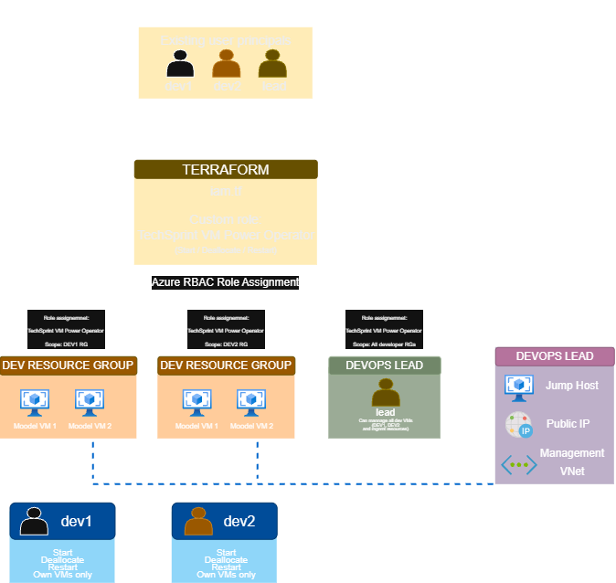
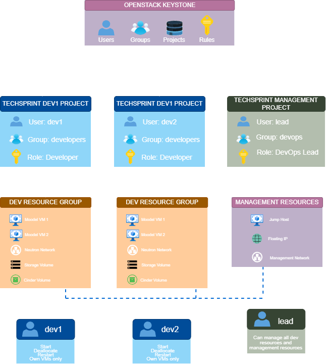

# IRUO TechSprint – Implementacija računarstva u oblaku

Projekt je izrađen u sklopu kolegija **Implementacija računarstva u oblaku (IRUO)**.

Cilj projekta je dizajnirati i automatizirati implementaciju izoliranih testnih okruženja za Moodle aplikaciju na dvije cloud platforme:

- Microsoft Azure
- OpenStack

Infrastruktura se definira pomoću **Terraform IaC-a**, dok se konfiguracija aplikacijskih virtualnih strojeva automatizira pomoću **Ansiblea**.

Korisnici i njihove uloge definirani su u `data/users.csv`, što omogućuje dinamičko kreiranje infrastrukture za varijabilan broj developera.

Testni scenarij koristi:

- `dev1` – developer
- `dev2` – developer
- `lead` – DevOps Lead

---

# Arhitektura

Svaki developer dobiva izolirano razvojno okruženje koje uključuje:

- zasebnu virtualnu mrežu
- dvije Moodle instance
- privatni load balancer
- OS i data disk
- object storage
- shared file storage
- sigurnosna pravila
- ograničena prava upravljanja

Centralni **Jump Host** služi kao jedina javno dostupna virtualna mašina i kao administrativna pristupna točka privatnim Moodle instancama.

Developer mreže međusobno nisu direktno povezane.

---

## Azure arhitektura

Azure implementacija koristi zaseban VNet i Resource Group za svakog developera te centralni Management VNet.

- DEV1 VNet: `10.10.1.0/24`
- DEV2 VNet: `10.10.2.0/24`
- Management VNet: `10.10.100.0/24`
- dvije Moodle VM instance po developeru
- `Standard_B2s` – 2 vCPU / 4 GB RAM
- privatni Azure Standard Load Balancer
- Managed Disks
- Azure Blob Storage
- Azure Files
- NSG i ASG
- Managed Identities
- Azure RBAC
- Public IP samo na Jump Hostu

Detaljniji opis arhitekture i izbora Azure resursa:

- [`docs/azure-architecture.md`](docs/azure-architecture.md)
- [`docs/azure-resource-selection.md`](docs/azure-resource-selection.md)
- [`docs/azure-lb-vs-app-gateway.md`](docs/azure-lb-vs-app-gateway.md)

---

## Azure RBAC

Developerima se dodjeljuje prilagođena **TechSprint VM Power Operator** uloga na razini vlastitog Resource Groupa.

Time developer može upravljati stanjem vlastitih VM-ova, dok DevOps Lead ima prava upravljanja svim developer okruženjima i administrativni pristup kroz Jump Host.

Detaljniji opis:

- [`docs/azure-rbac.md`](docs/azure-rbac.md)

---

## OpenStack arhitektura

OpenStack implementacija koristi:

- Nova – compute
- Neutron – networking
- Cinder – block storage
- Swift – object storage
- Octavia – load balancing

Za svakog developera kreira se zasebna privatna mreža:

- DEV1: `10.10.1.0/24`
- DEV2: `10.10.2.0/24`
- Management: `10.10.100.0/24`

Svaki developer ima dvije Moodle instance iza privatnog Octavia Load Balancera.

Samo Jump Host koristi Floating IP, dok Moodle instance ostaju privatne.

U Red Hat Academy okruženju koristi se dostupni `rhel8` image i `default` flavor s 2 vCPU i 2 GB RAM-a. Projektni zahtjev predviđa 4 GB RAM-a, ali takav flavor nije dostupan studentskom korisniku laboratorija.

Detaljniji opis OpenStack implementacije:

- [`docs/openstack.md`](docs/openstack.md)

---

## OpenStack IAM/RBAC

Ciljani IAM model koristi **Keystone** projekte, korisnike, grupe i role.

Svaki developer ima vlastiti projekt i pristup samo vlastitim resursima, dok DevOps Lead ima pristup svim developer projektima i management okruženju.

Red Hat Academy korisnik nema administratorska prava potrebna za kreiranje zasebnih Keystone projekata, korisnika, grupa i custom rola. Zbog toga laboratorijska implementacija koristi postojeći `finance` projekt, dok je ciljani IAM model dokumentiran zasebno.

Detaljniji opis:

- [`docs/openstack-iam-rbac.md`](docs/openstack-iam-rbac.md)

---

# Storage

Na obje platforme implementirani su odgovarajući koncepti block, object i file storagea.

| Funkcija | Azure | OpenStack |
|---|---|---|
| Block storage | Managed Disk | Cinder Volume |
| Object storage | Blob Storage | Swift |
| File storage | Azure Files | NFS fallback / Manila ekvivalent |

Svaka Moodle VM ima OS disk i dodatni **10 GB data disk**.

Azure koristi Azure Files za shared storage. U OpenStack Academy okruženju nije bilo moguće potvrditi dostupnost Manila servisa, pa je implementiran NFS fallback koristeći Cinder-backed storage.

---

# Load Balancing

Za svakog developera koriste se dvije Moodle instance iza privatnog load balancera.

**Azure**

- Azure Standard Load Balancer
- HTTP port 80
- health endpoint `/moodle-health.html`

**OpenStack**

- Octavia Load Balancer
- `ROUND_ROBIN`
- HTTP health monitor `/moodle-health.html`

Azure Standard Load Balancer odabran je umjesto Application Gatewaya jer projekt ne zahtijeva napredne Layer 7 funkcionalnosti.

Detaljnije:

- [`docs/azure-lb-vs-app-gateway.md`](docs/azure-lb-vs-app-gateway.md)

---

# Azure vs OpenStack

Projekt implementira istu osnovnu arhitekturu na obje platforme koristeći njihove ekvivalentne cloud servise.

| Funkcionalnost | Microsoft Azure | OpenStack |
|---|---|---|
| Compute | Azure Virtual Machines | Nova |
| Virtualna mreža | Virtual Network | Neutron |
| Load Balancer | Azure Standard Load Balancer | Octavia |
| Block storage | Managed Disks | Cinder |
| Object storage | Blob Storage | Swift |
| File storage | Azure Files | Manila / NFS fallback |
| Identity | Microsoft Entra ID | Keystone |
| Autorizacija | Azure RBAC | Keystone Roles / Policies |
| Network security | NSG + ASG | Security Groups |
| Javni pristup | Public IP | Floating IP |
| IaC | AzureRM / AzAPI | OpenStack Provider |

Azure pruža veći broj potpuno upravljanih servisa i integrirani IAM model, dok OpenStack omogućuje veću kontrolu nad infrastrukturom i pogodniji je za privatna cloud okruženja, uz veću odgovornost administratora za konfiguraciju i održavanje.

---

# Automatizacija

Ulaz za deployment je:

    data/users.csv

Primjer:

    username,role,environment
    dev1,developer,dev
    dev2,developer,dev
    lead,lead,management

Terraform koristi `csvdecode()` za dinamičko generiranje developer okruženja.

Dodavanjem novog developera u CSV nije potrebno duplicirati Terraform resurse.

OpenStack deployment automatiziran je kroz:

    scripts/deploy-openstack.sh

Workflow:

    users.csv
        ↓
    Terraform
        ↓
    OpenStack infrastruktura
        ↓
    Terraform outputs
        ↓
    generate-ansible-inventory.py
        ↓
    Ansible inventory
        ↓
    Ansible playbooks
        ↓
    Moodle konfiguracija

Ansible konfiguracija nalazi se u:

    ansible/playbooks/

Glavni playbookovi:

- `configure-moodle.yml`
- `configure-file-storage.yml`

Dinamički inventory generira:

    scripts/generate-ansible-inventory.py

Backup automatizacija:

    scripts/backup-openstack.sh

Azure deployment skripta:

    scripts/deploy-azure.sh

---

# Sigurnost i izolacija

Glavne sigurnosne mjere projekta:

- samo Jump Host ima javni IP
- Moodle instance nemaju direktan javni pristup
- svaki developer ima zasebnu virtualnu mrežu
- developer mreže međusobno nisu direktno povezane
- NSG/ASG koriste se na Azureu
- Security Groups koriste se na OpenStacku
- SSH administracija privatnih VM-ova ide preko Jump Hosta
- developer prava ograničena su na vlastite resurse
- DevOps Lead upravlja svim developer okruženjima
- storage pristup projektiran je prema least-privilege principu
- credentiali i privatni SSH ključevi nisu spremljeni u Git repozitoriju

---

# Naming i tagging

Projekt koristi konzistentnu naming konvenciju.

Primjeri:

    techsprint-dev1-moodle-1
    techsprint-dev1-moodle-2
    techsprint-dev1-network
    techsprint-dev1-moodle-sg

Standardni tagovi:

    project:techsprint
    environment:testing

Dodatno se koriste `owner` i `role` oznake gdje ih pojedini cloud resurs podržava.

Detaljnije:

- [`docs/naming-convention.md`](docs/naming-convention.md)
- [`docs/naming-and-tagging.md`](docs/naming-and-tagging.md)

---

# Procjena Azure troškova

Za Azure implementaciju izrađena je procjena mjesečnih troškova koja uključuje glavne compute, storage, networking i load-balancing komponente projekta.

Detaljna procjena:

- [`docs/azure-cost-estimate.md`](docs/azure-cost-estimate.md)

---

# Validacija i ograničenja

Terraform, Ansible i pomoćne skripte validirane su u dostupnim laboratorijskim okruženjima.

Korištene provjere uključuju:

    terraform validate
    ansible-playbook --syntax-check
    python3 -m py_compile
    bash -n

Potpuni Azure deployment nije mogao biti izvršen zbog ograničenja **Azure for Students Starter** pretplate i nedostupnosti potrebnih resource providera.

OpenStack infrastruktura djelomično je runtime testirana u Red Hat Academy okruženju. Finalni deployment blokiran je Academy infrastrukturnim ograničenjem:

    No valid host was found. There are not enough hosts available.

Dodatna Academy ograničenja uključuju ograničena Keystone administratorska prava, dostupni 2 GB flavor i probleme s dostupnim Octavia compute kapacitetom.

Projekt ne predstavlja navedene dijelove kao potpuno runtime verificirane ako ih laboratorijsko okruženje nije omogućilo.

Detaljnije:

- [`docs/azure-limitations.md`](docs/azure-limitations.md)
- [`docs/openstack.md`](docs/openstack.md)

---

# Dokumentacija

Detaljnija projektna dokumentacija nalazi se u direktoriju [`docs/`](docs/):

- [Azure arhitektura](docs/azure-architecture.md)
- [Azure izbor resursa](docs/azure-resource-selection.md)
- [Azure Load Balancer vs Application Gateway](docs/azure-lb-vs-app-gateway.md)
- [Azure RBAC](docs/azure-rbac.md)
- [Azure procjena troškova](docs/azure-cost-estimate.md)
- [Azure ograničenja](docs/azure-limitations.md)
- [OpenStack implementacija](docs/openstack.md)
- [OpenStack IAM/RBAC](docs/openstack-iam-rbac.md)
- [Naming convention](docs/naming-convention.md)
- [Naming i tagging](docs/naming-and-tagging.md)

---

# Status projekta

Implementirani su:

- Azure i OpenStack Terraform IaC
- CSV-driven provisioning
- dvije Moodle instance po developeru
- izolirane developer mreže
- Jump Host
- privatni load balancing
- block, object i file storage koncepti
- Azure NSG/ASG i OpenStack Security Groups
- Azure RBAC i OpenStack IAM dizajn
- Ansible Moodle konfiguracija
- dinamičko generiranje Ansible inventoryja
- deployment i backup automatizacija
- naming i tagging
- Azure i OpenStack arhitekturni dijagrami
- Azure RBAC i OpenStack IAM/RBAC dijagrami
- Azure procjena troškova
- Azure/OpenStack usporedba
- dokumentirana ograničenja laboratorijskih okruženja

Projekt demonstrira **Infrastructure as Code** pristup dizajnu i automatizaciji izoliranih razvojnih cloud okruženja na Microsoft Azure i OpenStack platformama.
