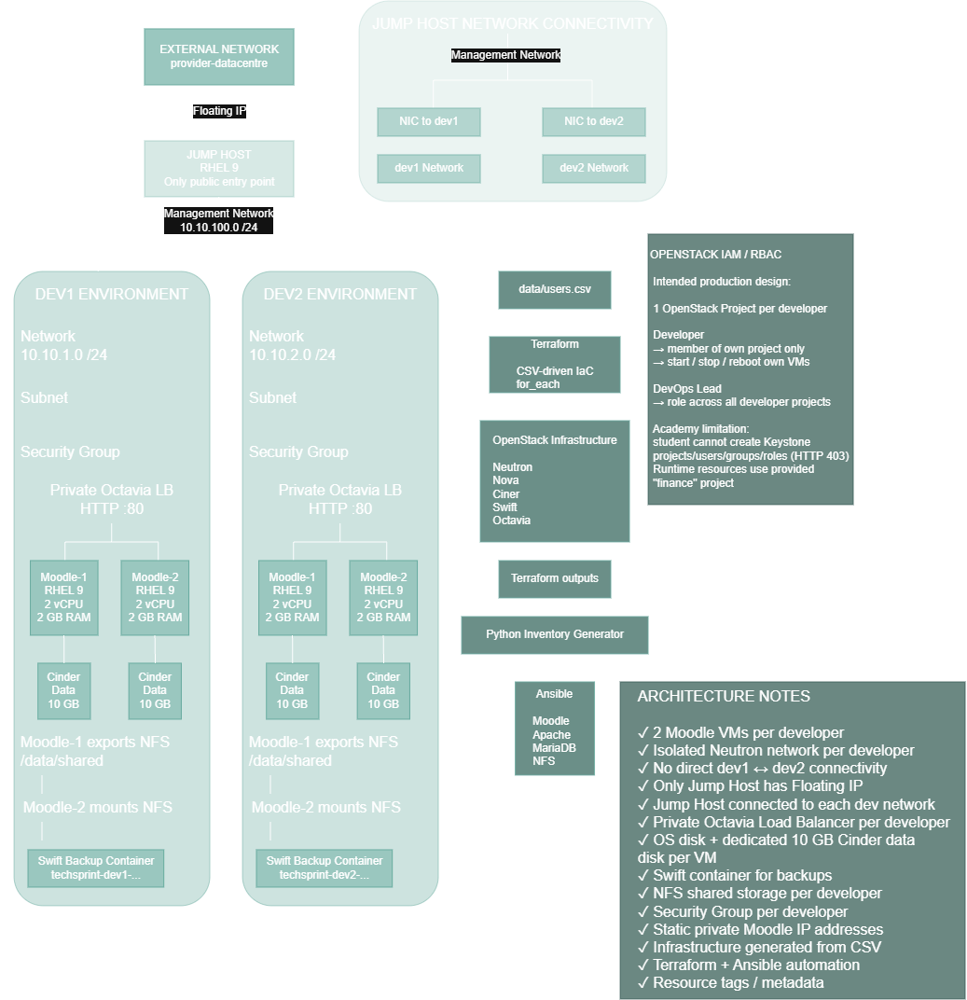

# IRUO TechSprint

Projekt iz kolegija **Implementacija računarstva u oblaku**.

Cilj projekta je automatizirati implementaciju izoliranih razvojnih okruženja za Moodle aplikaciju korištenjem dvije cloud platforme:

- Microsoft Azure
- OpenStack

Infrastruktura je definirana kao kod pomoću **Terraforma**, dok se konfiguracija aplikacijskih poslužitelja automatizira pomoću **Ansiblea**.

Ulazni podaci o korisnicima nalaze se u `data/users.csv`, a infrastruktura se dinamički generira prema korisnicima i njihovim ulogama.

## Tehnologije

- Terraform
- Ansible
- Microsoft Azure
- OpenStack
- AzureRM
- AzAPI
- OpenStack Neutron
- OpenStack Nova
- OpenStack Cinder
- OpenStack Swift
- OpenStack Octavia
- Python
- Bash
- Git
- GitHub

---

# Arhitektura

## Microsoft Azure

Azure implementacija koristi zaseban Resource Group i VNet za svakog developera.

Svaki developer dobiva:

- izolirani VNet
- developer subnet
- NSG i ASG
- dvije Moodle virtualne mašine
- interni Load Balancer
- zaseban data disk za svaku Moodle VM
- Blob container za backup
- Azure Files za shared storage

Management VNet sadrži Jump Host koji predstavlja jedinu javno dostupnu virtualnu mašinu.

Management VNet povezan je s developer VNetovima pomoću VNet peeringa, dok između developer VNetova ne postoji direktan peering.


Detaljniji opis nalazi se u:

`docs/azure-architecture.md`

---

## OpenStack

OpenStack implementacija koristi zasebnu Neutron mrežu za svakog developera.

Svaki developer dobiva:

- izoliranu Neutron mrežu i subnet
- router
- security group
- dvije Moodle virtualne mašine
- privatni Octavia Load Balancer
- zaseban Cinder data volume za svaku Moodle VM
- Swift container za backup
- NFS shared storage između Moodle instanci

Jump Host je jedina virtualna mašina s Floating IP adresom i povezan je s management mrežom te dodatnim mrežnim sučeljima s developer mrežama.

Developer mreže nisu međusobno povezane.



Detaljniji opis nalazi se u:

`docs/openstack.md`

---

# Automatizacija

Projekt koristi zajedničku CSV datoteku:

```text
data/users.csv
```

Primjer:

```csv
username,role,environment
dev1,developer,dev
dev2,developer,dev
lead,lead,management
```

Terraform obrađuje CSV i pomoću `for_each` dinamički generira infrastrukturu za developere.

OpenStack deployment dodatno koristi sljedeći automatizacijski tok:

```text
users.csv
   |
   v
Terraform
   |
   v
OpenStack Infrastructure
   |
   v
Terraform Outputs
   |
   v
Python Inventory Generator
   |
   v
Ansible
   |
   v
Moodle + NFS configuration
```

Na taj način konfiguracija nije ograničena isključivo na `dev1` i `dev2`, nego se može proširiti dodavanjem novih korisnika u CSV datoteku.

---

# Struktura repozitorija

```text
iruo-techsprint/
|
├── azure/
│   ├── full/
│   └── starter-test/
|
├── openstack/
|
├── ansible/
│   ├── inventory/
│   ├── playbooks/
│   └── roles/
|
├── data/
|
├── diagrams/
|
├── docs/
|
├── scripts/
|
├── .gitignore
└── README.md
```

## `azure/`

Sadrži Terraform konfiguraciju za Microsoft Azure.

### `azure/full/`

Glavna Azure Infrastructure as Code implementacija.

| Datoteka | Namjena |
|---|---|
| `versions.tf` | Definira Terraform i provider zahtjeve. |
| `providers.tf` | Konfigurira AzureRM i AzAPI providere. |
| `variables.tf` | Definira ulazne varijable projekta. |
| `locals.tf` | Obrađuje CSV korisnike i priprema interne Terraform strukture. |
| `resource-group.tf` | Kreira centralni i developer Resource Groupove. |
| `network.tf` | Kreira Management i developer VNete, subnetove i VNet peering. |
| `security.tf` | Definira Network Security Groups i pripadajuća sigurnosna pravila. |
| `asg.tf` | Definira Application Security Groups za Moodle virtualne mašine. |
| `compute.tf` | Kreira Jump Host i dvije Moodle VM instance po developeru. |
| `loadbalancer.tf` | Kreira privatni interni Load Balancer za svaki developer environment. |
| `storage.tf` | Kreira Managed Diskove, Storage Account, Blob Storage i Azure Files. |
| `storage-rbac.tf` | Definira RBAC pristup storage resursima. |
| `storage-smb-oauth.tf` | Konfigurira identity-based pristup Azure Files storageu. |
| `iam.tf` | Definira Azure RBAC role i role assignmente za upravljanje VM-ovima. |
| `outputs.tf` | Definira informacije koje Terraform prikazuje nakon deploymenta. |

### `azure/starter-test/`

Sadrži dokumentaciju i konfiguracijski kontekst povezan s Azure for Students Starter okolinom i ograničenjima pretplate.

---

# `openstack/`

Sadrži Terraform konfiguraciju za OpenStack implementaciju.

| Datoteka | Namjena |
|---|---|
| `versions.tf` | Definira Terraform i OpenStack provider zahtjeve. |
| `providers.tf` | Konfigurira OpenStack provider. |
| `variables.tf` | Definira ulazne varijable. |
| `locals.tf` | Obrađuje CSV korisnike, mrežne raspone i Moodle instance. |
| `network.tf` | Kreira developer i management mreže, subnetove i routere. |
| `security.tf` | Kreira security grupe i mrežna pravila. |
| `keypair.tf` | Registrira SSH public key za pristup virtualnim mašinama. |
| `compute.tf` | Definira Jump Host i dvije Moodle VM instance po developeru. |
| `moodle-ports.tf` | Kreira determinističke Neutron portove i privatne IP adrese Moodle instanci. |
| `jump-network.tf` | Povezuje Jump Host dodatnim sučeljima s developer mrežama. |
| `floating-ip.tf` | Dodjeljuje Floating IP Jump Hostu. |
| `storage.tf` | Kreira i priključuje zasebne Cinder data volumene Moodle VM-ovima. |
| `object-storage.tf` | Kreira Swift backup container za svakog developera. |
| `loadbalancer.tf` | Definira privatne Octavia load balancere, listenere, poolove, members i health monitore. |
| `outputs.tf` | Izlaže podatke potrebne za administraciju i generiranje Ansible inventoryja. |

---

# `ansible/`

Sadrži konfiguracijski management za Moodle virtualne mašine.

### `ansible/ansible.cfg`

Definira osnovnu Ansible konfiguraciju i lokaciju inventoryja.

### `ansible/inventory/inventory.ini`

Inventory struktura za Jump Host i Moodle instance.

Kod automatiziranog deploymenta inventory se može generirati iz Terraform outputa.

### `ansible/playbooks/configure-moodle.yml`

Automatizira:

- instalaciju Apachea
- instalaciju MariaDB-a
- instalaciju PHP-a
- pripremu Cinder data diska
- kreiranje Moodle baze
- instalaciju Moodle aplikacije
- Moodle data direktorij
- firewall
- load balancer health endpoint

### `ansible/playbooks/configure-file-storage.yml`

Automatizira NFS shared storage između dvije Moodle instance istog developera.

Primarna Moodle instanca izvozi `/data/shared`, a sekundarna ga automatski montira.

---

# `scripts/`

Sadrži pomoćne skripte za deployment i administraciju.

### `scripts/deploy-azure.sh`

Orkestrira Azure Terraform deployment.

### `scripts/deploy-openstack.sh`

Orkestrira kompletan OpenStack deployment:

1. provjera CSV datoteke
2. provjera potrebnih varijabli
3. Terraform init
4. Terraform validate
5. Terraform apply
6. Terraform outputs
7. generiranje Ansible inventoryja
8. Moodle konfiguracija
9. shared storage konfiguracija

### `scripts/generate-ansible-inventory.py`

Iz Terraform outputa dinamički generira Ansible inventory.

Time se izbjegava ručno održavanje IP adresa i developer grupa.

### `scripts/backup-openstack.sh`

Automatizira Moodle backup:

- MariaDB dump
- Moodle application files
- Moodle data
- kreiranje arhive
- upload u developer Swift container

---

# `data/`

## `data/users.csv`

Centralna ulazna datoteka za korisnike i njihove uloge.

Terraform koristi ovu datoteku za dinamičko generiranje developer infrastrukture.

---

# `diagrams/`

Sadrži arhitekturne dijagrame projekta.

| Datoteka | Namjena |
|---|---|
| `azure-architecture.drawio` | Izvorni draw.io Azure arhitekturni dijagram. |
| `azure-architecture.png` | Azure dijagram za GitHub i projektnu dokumentaciju. |
| `openstack-architecture.drawio` | Izvorni draw.io OpenStack arhitekturni dijagram. |
| `openstack-architecture.png` | OpenStack dijagram za GitHub i projektnu dokumentaciju. |

---

# `docs/`

Sadrži detaljnu tehničku dokumentaciju i obrazloženja projektnih odluka.

| Dokument | Namjena |
|---|---|
| `architecture.md` | Zajednički pregled arhitekture projekta. |
| `azure-architecture.md` | Detaljna Azure arhitektura. |
| `azure-cost-estimate.md` | Procjena troškova Azure infrastrukture. |
| `azure-lb-vs-app-gateway.md` | Usporedba Load Balancera i Application Gatewaya te obrazloženje izbora. |
| `azure-limitations.md` | Dokumentira ograničenja Azure Students Starter pretplate. |
| `azure-rbac.md` | Dokumentira Azure RBAC model. |
| `azure-resource-selection.md` | Obrazlaže izbor Azure servisa i resursa. |
| `naming-and-tagging.md` | Dokumentira naming i tagging strategiju. |
| `naming-convention.md` | Definira konvenciju imenovanja resursa. |
| `openstack-iam-rbac.md` | Dokumentira OpenStack IAM/RBAC dizajn i Academy ograničenja. |
| `openstack.md` | Detaljna dokumentacija OpenStack implementacije. |

---

# Naming i tagging

Resursi koriste konzistentnu TechSprint naming konvenciju.

Primjeri:

```text
techsprint-dev1-network
techsprint-dev1-moodle-1
techsprint-dev1-moodle-1-data
techsprint-dev1-lb
```

Gdje platforma i provider podržavaju tagging ili metadata, koriste se oznake poput:

```text
project:techsprint
environment:testing
owner:dev1
role:moodle
```

Detalji se nalaze u dokumentima:

- `docs/naming-convention.md`
- `docs/naming-and-tagging.md`

---

# Sigurnost

Arhitektura je dizajnirana prema principu minimalnog potrebnog pristupa.

Ključne sigurnosne karakteristike:

- Moodle VM-ovi nisu direktno javno dostupni
- Jump Host predstavlja administrativnu ulaznu točku
- developer mreže međusobno su izolirane
- koriste se NSG/ASG odnosno OpenStack Security Groups
- aplikacijske tajne nisu spremljene u Git repozitoriju
- OpenStack backup credentials ostaju na deployment hostu
- resource ownership označen je tagovima i metadata vrijednostima
- developer VM power permissions ograničene su prema dizajnu platforme

---

# Validacija i ograničenja

## Azure

Azure Terraform konfiguracija razvijena je i sintaktički validirana.

Potpuni runtime deployment nije bilo moguće izvršiti zbog ograničenja **Azure for Students Starter** pretplate i nedostupnosti potrebnih Azure resource providera.

Detalji:

`docs/azure-limitations.md`

## OpenStack

OpenStack Terraform konfiguracija uspješno prolazi:

```bash
terraform validate
```

Tijekom razvoja uspješno su testirani pojedini infrastrukturni dijelovi, uključujući networking i Jump Host.

Finalni end-to-end deployment nije bilo moguće završiti zbog ograničenja Red Hat Academy okoline.

Glavna zabilježena ograničenja uključuju:

- Nova `NoValidHost` / nedostupan compute kapacitet
- ograničene Keystone administratorske dozvole
- Octavia testni Load Balancer ostao je u `PENDING_CREATE`
- Manila dostupnost nije bilo moguće potvrditi

Projekt zato jasno razlikuje implementiranu i validiranu konfiguraciju od funkcionalnosti koju nije bilo moguće potpuno runtime potvrditi u studentskoj okolini.

Detalji:

`docs/openstack.md`

---

# Dokumentacija

Detaljnija projektna dokumentacija nalazi se u:

```text
docs/
```

Dokumentacija uključuje:

- Azure arhitekturu
- OpenStack arhitekturu
- IAM/RBAC
- naming i tagging
- izbor Azure resursa
- Load Balancer vs Application Gateway odluku
- Azure cost estimate
- ograničenja studentskih cloud okolina

---

# Status projekta

Implementirana je Infrastructure as Code struktura za Azure i OpenStack s:

- CSV-driven provisioningom
- dvije Moodle instance po developeru
- izoliranim developer mrežama
- centralnim Jump Hostom
- load balancingom
- block storageom
- object storageom
- shared file storageom
- RBAC/IAM dizajnom
- automatiziranom Moodle konfiguracijom
- backup automatizacijom
- naming i tagging konvencijom
- tehničkom dokumentacijom

Runtime ograničenja studentskih cloud okolina dokumentirana su zasebno i ne prikazuju se kao uspješno izvršeni deploymenti.
