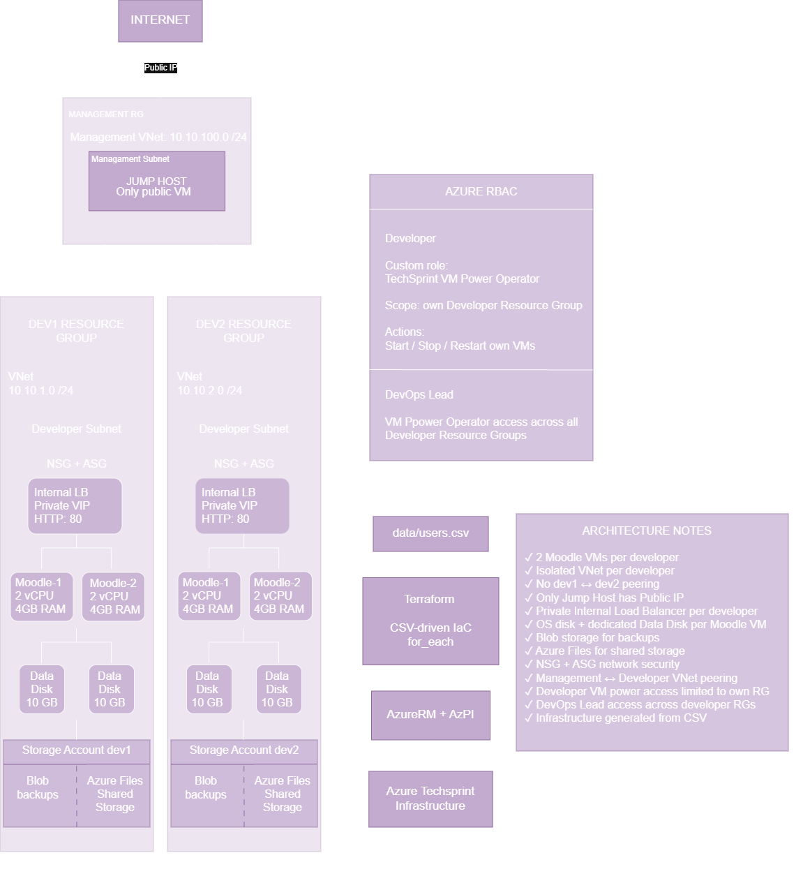

# IRUO TechSprint

Projekt iz kolegija Implementacija računarstva u oblaku.

Cilj projekta je automatizirana implementacija izoliranih testnih okolina za Moodle aplikaciju koristeći Microsoft Azure i OpenStack.

## Tehnologije

- Terraform
- Ansible
- Microsoft Azure
- OpenStack
- Git
- GitHub

Azure Network and Security

The diagram presents the overall Azure infrastructure architecture of the TechSprint environment. A central Jump Host provides administrative access to two isolated developer environments through VNet peering. Each developer environment contains two Moodle virtual machines behind an Internal Load Balancer, dedicated managed data disks, and a separate Storage Account for backups and shared files. Only the Jump Host is publicly accessible, while the Moodle instances remain on private networks.
