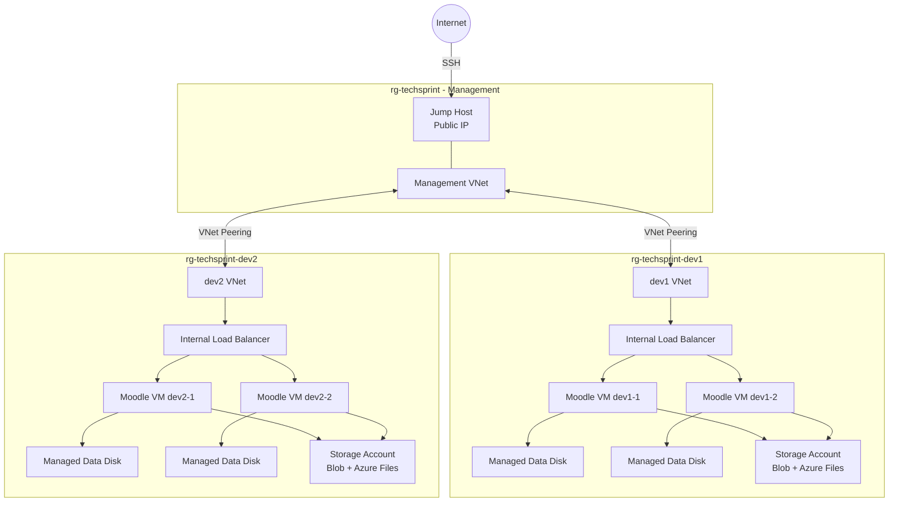

# Azure Architecture

## Overview

The Azure implementation deploys an isolated Moodle environment for every developer defined in `data/users.csv`.

Each developer receives:

- Dedicated Resource Group
- Dedicated Virtual Network and subnet
- Two Moodle virtual machines for simulated high availability
- Internal Azure Load Balancer
- Application Security Group
- Network Security Group
- Managed data disk for each Moodle VM
- Azure Storage Account
- Blob container for backups
- Azure Files share for shared storage
- Managed Identity based storage access

A central management environment contains the Jump Host used to access developer environments.

## Architecture



## Network isolation

Each developer receives a separate VNet.

There is no direct peering between developer VNets. Therefore, developer environments are isolated from each other.

The management VNet is peered individually with every developer VNet. This allows the Jump Host to reach the private developer VMs without exposing those VMs directly to the Internet.

Only the Jump Host has a public IP address.

## High availability

Two Moodle instances are created for every developer.

For example:

- `vm-dev1-moodle-1`
- `vm-dev1-moodle-2`

Both instances are registered in the backend pool of the developer's internal Azure Load Balancer.

The Load Balancer performs an HTTP health check using:

`/moodle-health.html`

Only healthy instances receive traffic.

This implementation simulates application-level high availability for the course environment.

## Storage

Each developer receives a dedicated Storage Account containing:

- Blob container `moodle-backups`
- Azure Files share `moodle-shared`

Each Moodle VM also receives its own Managed Data Disk.

Storage access uses the VM System Assigned Managed Identity instead of storing Storage Account keys inside the VM configuration.

Azure Files SMB OAuth is enabled through the AzAPI Terraform provider.

## Deployment

The complete environment is generated from:

`data/users.csv`

Deployment is started with:

```bash
export TF_VAR_moodle_db_password="<password>"
./scripts/deploy-azure.sh data/users.csv
```

The deployment script initializes and validates Terraform and performs the Terraform apply using the supplied CSV file.
