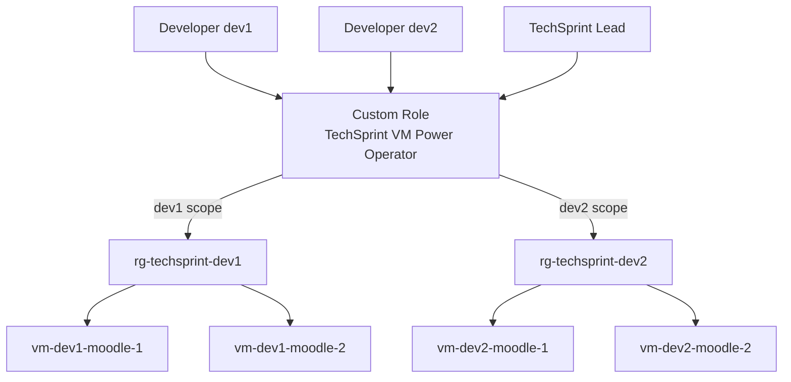

# Azure RBAC

## Principle

The TechSprint environment follows the principle of least privilege.

Developers can control the power state of their own virtual machines but cannot manage virtual machines belonging to other developers.

The TechSprint Lead can control the power state of all developer virtual machines.

## RBAC model

## Custom role

Terraform creates the custom role:

`TechSprint VM Power Operator`

The role contains only the actions required to:

- read VM information
- read VM instance state
- start a VM
- restart a VM
- power off a VM
- deallocate a VM

Developers are therefore not assigned the broader `Virtual Machine Contributor` role.

## Developer permissions

Each developer receives the custom role only on their own Resource Group.

Example:

`dev1 -> rg-techsprint-dev1`

`dev2 -> rg-techsprint-dev2`

This prevents a developer from controlling another developer's virtual machines.

## Lead permissions

The TechSprint Lead receives the same VM power-management role across all developer Resource Groups.

The Jump Host provides the central administrative SSH entry point into the private developer environments.

## VM Managed Identities

Every Moodle VM uses a System Assigned Managed Identity.

The identity receives:

- `Storage Blob Data Contributor`
- `Storage File Data SMB MI Admin`

The scope is restricted to the Storage Account belonging to that developer.
