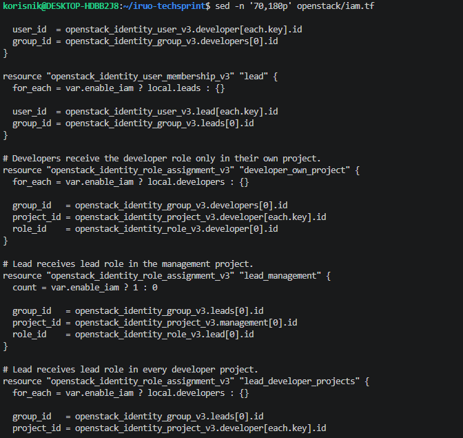
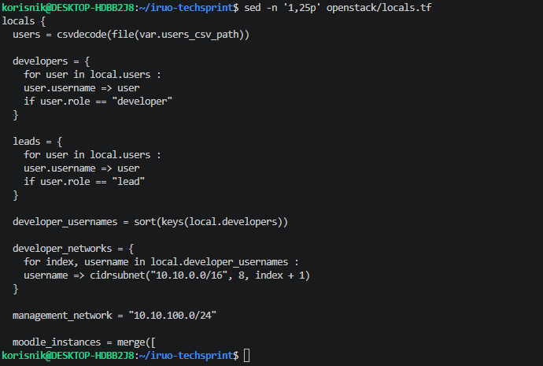
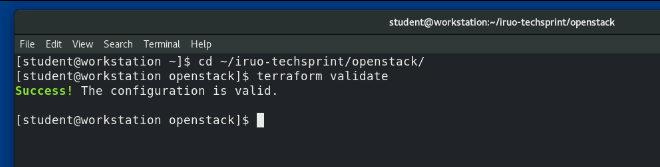
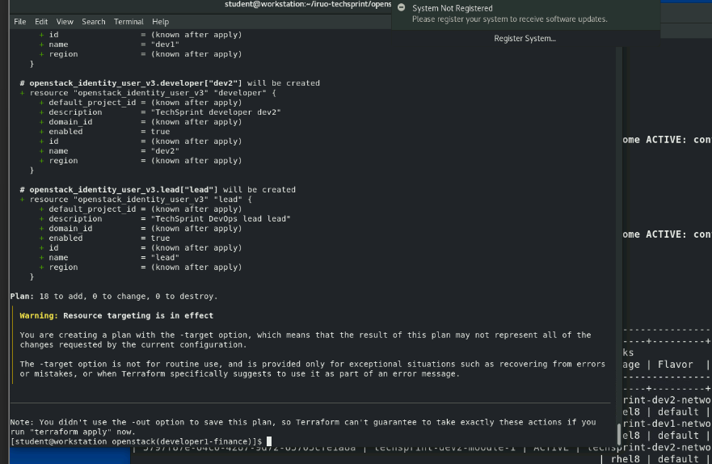
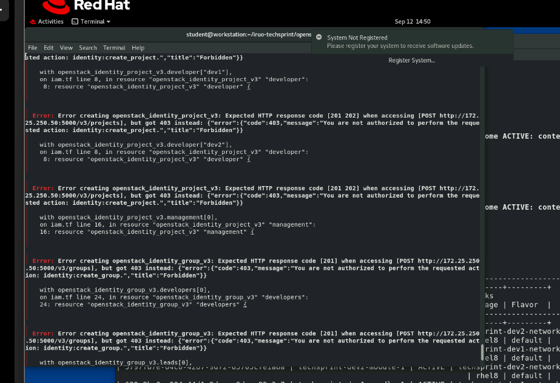
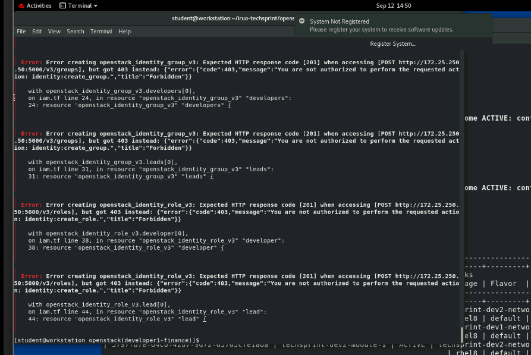
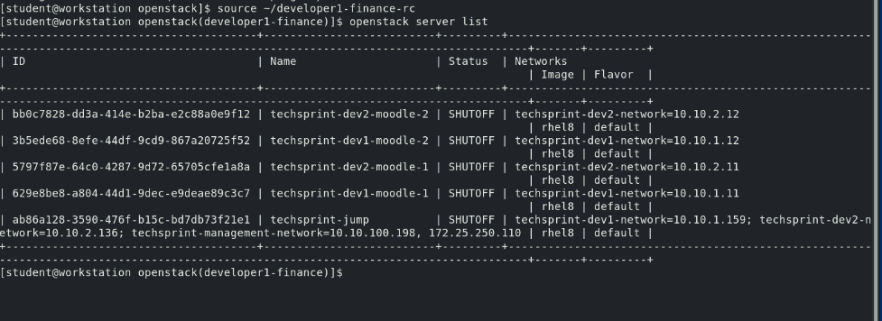

# OpenStack IAM implementacija i runtime validacija

## Pregled

OpenStack IAM automatizacija implementirana je Terraformom u datoteci `openstack/iam.tf`.

Korisnici se učitavaju dinamički iz `data/users.csv`. Za svakog developera Terraform definira zaseban Keystone projekt, korisnika i pripadajuće role assignmente. DevOps Lead definiran je kao zaseban identitet s proširenim pravima.

## Keystone IAM automatizacija

Terraform konfiguracija definira:

- zaseban Keystone projekt za svakog developera
- management projekt
- developer i lead grupe
- developer i lead role
- Keystone korisnike
- članstvo korisnika u grupama
- developer role assignment na vlastiti projekt
- lead role assignment na management i developer projekte

Implementacija:

Role assignments i memberships:

## Kreiranje iz users.csv

Ulazni korisnici definirani su u `data/users.csv`.

Testna konfiguracija sadrži:

- `dev1` - developer
- `dev2` - developer
- `lead` - DevOps Lead

Terraform koristi `csvdecode()` i prema atributu `role` dinamički razdvaja developere i voditelje.

## Izolacija developera i DevOps Lead

Za svakog developera Terraform definira zaseban Keystone projekt:

- `techsprint-dev1`
- `techsprint-dev2`

Developer role assignment vezan je samo uz projekt odgovarajućeg developera.

DevOps Lead je zaseban korisnik i član lead grupe. Njegov role assignment obuhvaća management projekt i developer projekte.

## Terraform validacija

IAM konfiguracija validirana je na Red Hat Academy OpenStack workstationu.

Rezultat:

`Success! The configuration is valid.`

## Terraform IAM plan

IAM resursi zasebno su provjereni Terraform planom.

Rezultat:

`Plan: 18 to add, 0 to change, 0 to destroy.`

Plan uključuje projekte, grupe, role, korisnike, memberships i role assignments za `dev1`, `dev2` i `lead`.

## Runtime pokušaj i ograničenje Red Hat Academy okruženja

Nakon uspješne validacije i plana napravljen je stvarni `terraform apply` IAM resursa.

Red Hat Academy Keystone odbio je administrativne IAM operacije s HTTP statusom `403 Forbidden`.

Zabilježene su zabrane za:

- `identity:create_project`
- `identity:create_group`
- `identity:create_role`

Terraform je došao do stvarnog Keystone API poziva, ali korisnik `developer1-finance` nema administratorske Keystone ovlasti potrebne za kreiranje projekata, grupa i rola.

Zbog ograničenja laboratorijskog računa zasebni Keystone projekti i role assignments nisu mogli biti stvarno primijenjeni. Implementacija zato ne tvrdi da su ti IAM resursi aktivni u Academy okruženju.

## Uspješno kreirana developerska infrastruktura

Compute infrastruktura za oba developera uspješno je kreirana.

Aktivne su:

- `techsprint-dev1-moodle-1`
- `techsprint-dev1-moodle-2`
- `techsprint-dev2-moodle-1`
- `techsprint-dev2-moodle-2`
- `techsprint-jump`

Sve navedene instance nalaze se u stanju `ACTIVE`.

Time je potvrđeno da je compute infrastruktura za oba testna developera uspješno kreirana.

## Zaključak

OpenStack IAM dio projekta sadrži automatizaciju za projekte, korisnike, grupe, role, memberships i role assignments generirane iz `users.csv`.

Terraform konfiguracija uspješno prolazi validaciju i generira IAM plan od 18 resursa. Stvarna primjena IAM resursa pokušala se izvršiti, ali je zaustavljena s `403 Forbidden` zbog nedostatka Keystone administratorskih ovlasti u Red Hat Academy okruženju.

Compute infrastruktura za oba developera uspješno je kreirana i instance su potvrđene u stanju `ACTIVE`.